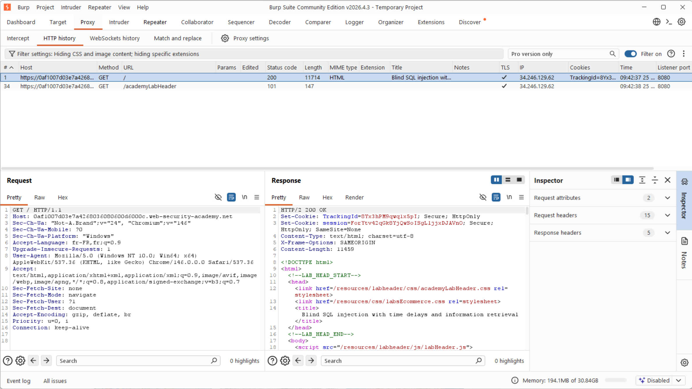
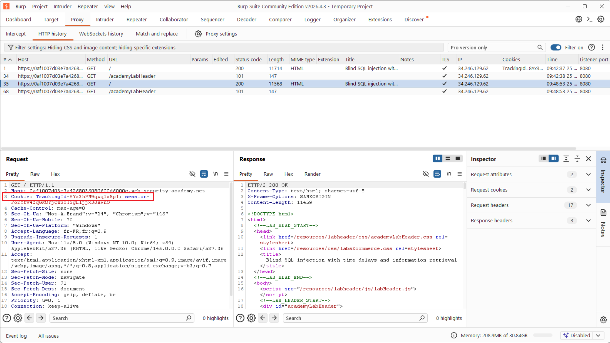
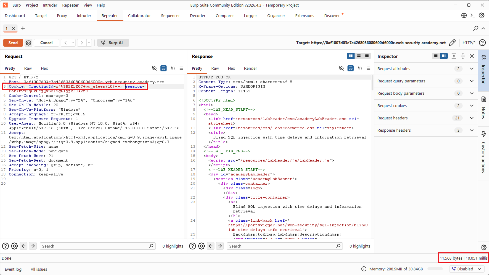
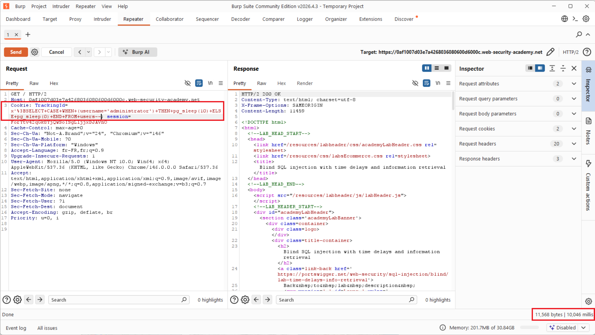
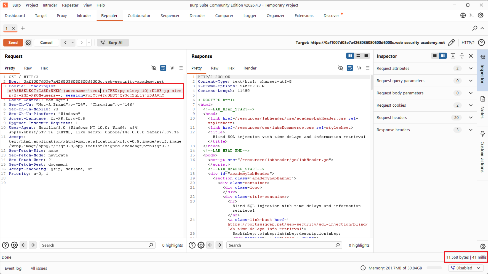
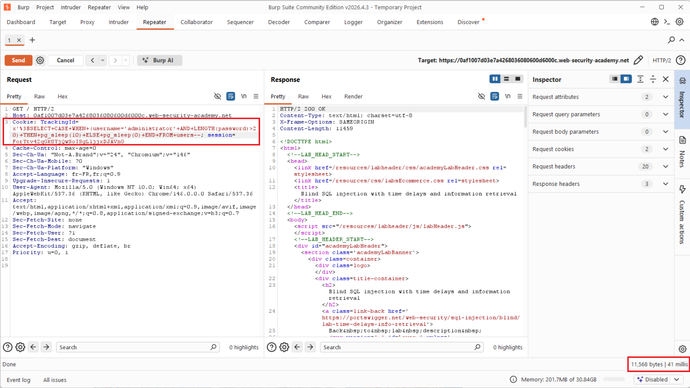
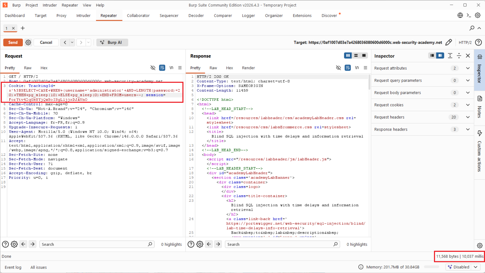
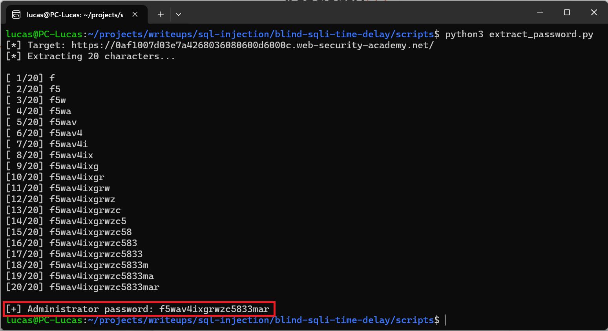
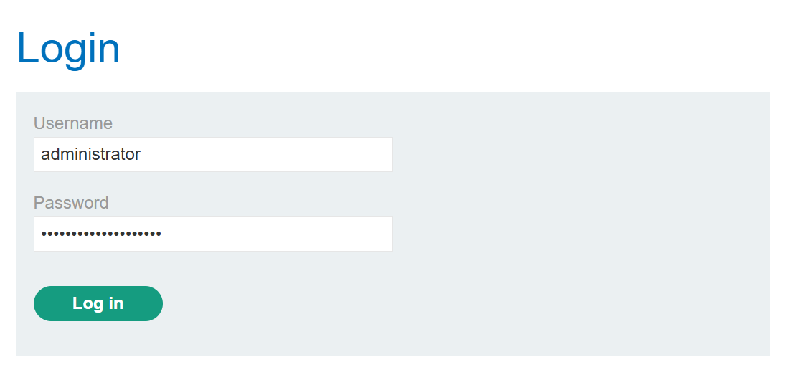
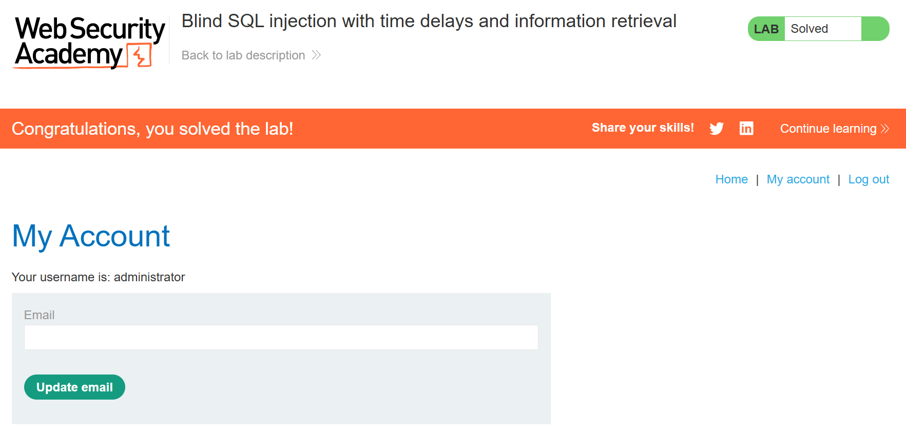

# Write-up - Blind SQL Injection (time-based) with data exfiltration

> Lab: **Blind SQL injection with time delays and information retrieval**
> Category: SQL Injection (CWE-89 / OWASP A03:2021)
> Difficulty: Practitioner . DBMS: **PostgreSQL**
> Legal platform: PortSwigger Web Security Academy

## Lab brief

> This lab contains a blind SQL injection vulnerability. The application uses a
> tracking cookie for analytics, and performs a SQL query containing the value of
> the submitted cookie.
>
> The results of the SQL query are not returned, and the application does not
> respond any differently based on whether the query returns any rows or causes
> an error. However, since the query is executed synchronously, it is possible to
> trigger conditional time delays to infer information.
>
> The database contains a different table called `users`, with columns called
> `username` and `password`. You need to exploit the blind SQL injection
> vulnerability to find out the password of the `administrator` user.
>
> To solve the lab, log in as the `administrator` user.
>
> Source: [PortSwigger Web Security Academy](https://portswigger.net/web-security/sql-injection/blind/lab-time-delays-info-retrieval)

## 1. Context

The application uses a tracking cookie (`TrackingId`) for analytics. The value of
that cookie is inserted into a SQL query on the server side. The result of the
query is never returned, and the page does not change whether the query succeeds,
fails, or returns no rows. The injection is therefore completely blind.

Because the query runs synchronously, we can trigger conditional time delays with
`pg_sleep` to answer yes or no questions by measuring the response time, and so
exfiltrate the password of the `administrator` user one character at a time.

- **Injection point**: `TrackingId` cookie
- **Goal**: recover the `administrator` password, then log in.

The target application home page:

<p align="center">
  
</p>

## 2. Environment and setup

| Item | Detail |
|---|---|
| OS | Windows 11 (WSL2 for the scripts) |
| Main tool | Burp Suite Community Edition |
| Browser | Chromium embedded in Burp (Open Browser) |
| Target | PortSwigger lab instance (ephemeral `*.web-security-academy.net` URL) |

Steps performed to get ready:

1. Installed and launched Burp Suite Community on Windows 11.
2. Created the project: Temporary project, Use Burp defaults, Start Burp.
3. Disabled interception (Proxy, Intercept set to "Intercept is off") to browse
   without blocking.
4. Opened the embedded browser (Proxy, Open Browser), already wired to the Burp
   proxy, so no proxy or certificate configuration was needed.
5. Loaded the lab home page in that browser.

## 3. Reconnaissance

The injection point was located by inspecting the traffic in Burp under Proxy,
HTTP history.

The very first `GET /` request did not carry any cookie, because the server had
not set the `TrackingId` yet:

<p align="center">
  
</p>

After reloading the page (F5), the browser sent back the cookie that had been set.
The new `GET /` request now contained the header:

```
Cookie: TrackingId=8Yx3hPM9qwq1x5pI; session=ForYtv42qGk8YjQwSoISgLljjxDJAVnO
```

The value of `TrackingId` is the one that will be abused for the injection:

<p align="center">
  
</p>

The request was then sent to Repeater (right click, Send to Repeater) so the
cookie could be edited and replayed.

## 4. Exploitation

### 4.1 Confirming the injection with a time delay

In Burp Repeater, the cookie value was replaced with a payload that closes the SQL
string (`'`), stacks a second statement (`;`, URL encoded as `%3B`), and forces a
server side delay:

```
Cookie: TrackingId=x'%3BSELECT+pg_sleep(10)--; session=...
```

The response came back after about 10 seconds instead of being immediate, which
proves that the cookie value is executed as SQL by PostgreSQL. The blind
time-based injection is confirmed.

<p align="center">
  
</p>

### 4.2 Verifying that the administrator user exists

A conditional payload triggers the delay only if a row with
`username='administrator'` exists in the `users` table:

```
Cookie: TrackingId=x'%3BSELECT+CASE+WHEN+(username='administrator')+THEN+pg_sleep(10)+ELSE+pg_sleep(0)+END+FROM+users--; session=...
```

The response took about 10 seconds, so the `administrator` user exists.

<p align="center">
  
</p>

Control test: with a non existent username (`username='test'`), the condition is
false, `pg_sleep(0)` runs, and the response is immediate. The contrast between the
true case (slow) and the false case (fast) confirms that we control the query
logic.

<p align="center">
  
</p>

### 4.3 Determining the password length

The length was found with a binary search on `LENGTH(password)`.

Test `>20`:

```
x'%3BSELECT+CASE+WHEN+(username='administrator'+AND+LENGTH(password)>20)+THEN+pg_sleep(10)+ELSE+pg_sleep(0)+END+FROM+users--
```

The response was immediate (about 41 ms), so the condition is false and the
password is 20 characters or shorter.

<p align="center">
  
</p>

Confirmation `=20`:

```
x'%3BSELECT+CASE+WHEN+(username='administrator'+AND+LENGTH(password)=20)+THEN+pg_sleep(10)+ELSE+pg_sleep(0)+END+FROM+users--
```

The response took about 10 seconds, so the password length is exactly 20
characters.

<p align="center">
  
</p>

### 4.4 Extracting the password character by character

For each position `i` from 1 to 20, each candidate character `c` is tested. The
one that triggers the delay (`pg_sleep`) is the correct one:

```
...AND+SUBSTRING(password,i,1)='c'...   (delay if true)
```

Doing 20 positions times about 36 characters by hand is not realistic, so the
extraction was automated with a Python script (`scripts/extract_password.py`) that
measures the response time of each request to rebuild the password.

Result:

```
[+] Administrator password: f5wav4ixgrwzc5833mar
```

Password of `administrator`: **`f5wav4ixgrwzc5833mar`**.

<p align="center">
  
</p>

### 4.5 Solving the lab

Logged in on `/login` with the recovered credentials:

- Username: `administrator`
- Password: `f5wav4ixgrwzc5833mar`

<p align="center">
  
</p>

The login succeeds and the lab shows the green banner "Congratulations, you solved
the lab!", which demonstrates the compromise of the `administrator` account.

<p align="center">
  
</p>

## 5. Impact

Even though the application returns no data and no error message (the injection is
fully blind), the mere ability to trigger a conditional delay is enough to turn
the database into a binary oracle and exfiltrate any information one bit at a time.

- **Confidentiality**: the `administrator` password was extracted and the account
  taken over. The same technique can read the whole `users` table, and more
  generally any data reachable by the application database account (other tables,
  metadata, DBMS version).
- **Trivial vector**: the attack needs no authentication. A single manipulable
  tracking cookie is enough.
- **Severity**: high. The entry point is a seemingly harmless analytics field,
  which makes it easy to miss during security reviews.

Indicative CVSS (no authentication, high confidentiality impact): High range, to
be adjusted depending on the real scope of the database and its privileges.

## 6. Remediation

The root cause is the concatenation of the cookie value into the SQL query.

- **Primary fix**: use parameterized queries (bound placeholders) or an ORM that
  parameterizes by default. The value must never be interpreted as code. With a
  prepared statement, `x';SELECT pg_sleep(10)--` is only an inert string compared
  against a value.
- **Least privilege**: the PostgreSQL account used by the application should have
  only the access it needs, with no ability to read `users` from the analytics
  context and no unnecessary functions.
- **Input validation**: a `TrackingId` has an expected format (alphanumeric, fixed
  length). Anything that does not match should be rejected.
- **Monitoring and logging**: do not expose SQL errors. Log and alert on abnormal
  queries (execution time, injection patterns).
- A WAF can help as an extra layer, never as a replacement for the application fix.

Reference: OWASP SQL Injection Prevention Cheat Sheet.

## Screenshot index

| # | File | Description |
|---|------|-------------|
| 01 | `01-homepage.png` | Full home page of the target application |
| 02 | `02-initial-request-no-cookie.png` | First `GET /` request in Burp, without cookie |
| 03 | `03-request-with-tracking-cookie.png` | `GET /` request after F5, carrying `Cookie: TrackingId=...` |
| 04 | `04-pg-sleep-delay-proof.png` | `pg_sleep(10)` injection, about 10 second delay (blind injection proof) |
| 05 | `05-administrator-exists-delay.png` | Condition `username='administrator'` true, about 10 second delay |
| 06 | `06-control-test-instant.png` | Condition `username='test'` false, instant response (control) |
| 07 | `07-password-length-gt20-false.png` | `LENGTH(password)>20` false, instant (password 20 chars or less) |
| 08 | `08-password-length-eq20-true.png` | `LENGTH(password)=20` true, about 10 second delay (length is 20) |
| 09 | `09-password-extracted.png` | Python script output, password recovered (`f5wav4ixgrwzc5833mar`) |
| 10 | `10-login-as-administrator.png` | Submitting the `administrator` credentials on `/login` |
| 11 | `11-lab-solved.png` | Green banner "Congratulations, you solved the lab!" |
